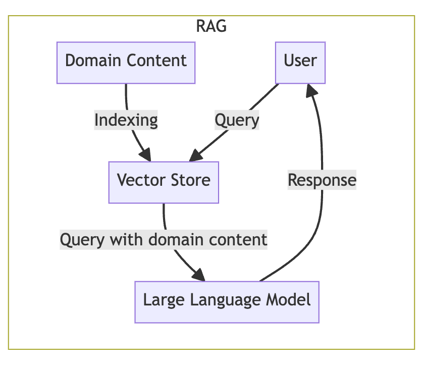
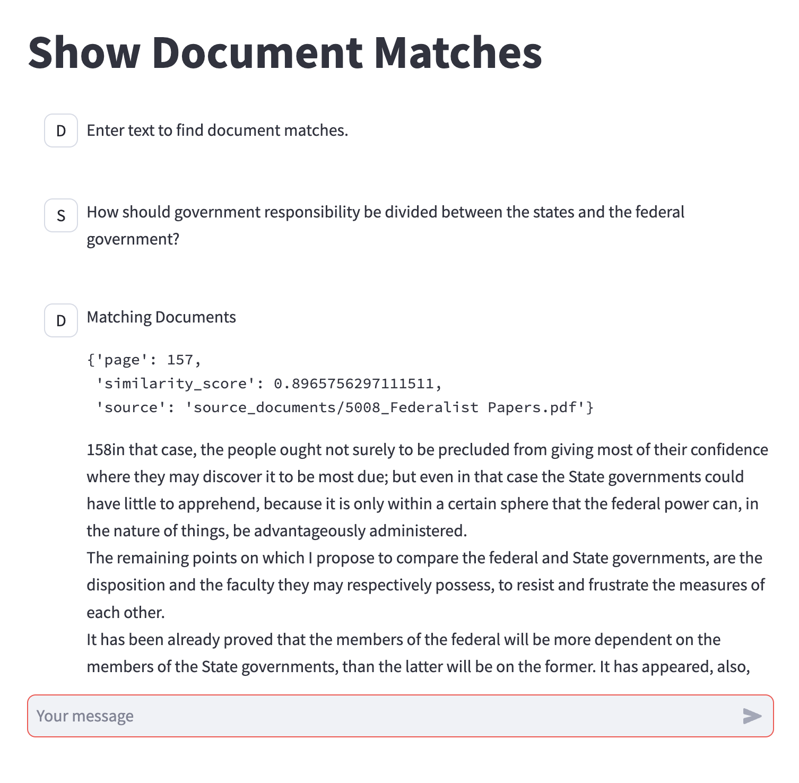
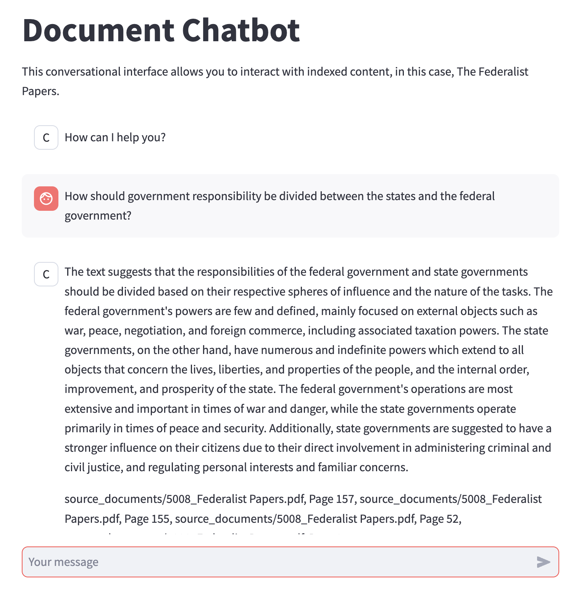

# Retrieval-Augmented Generation (RAG) Example

This repository contains code for demonstrating retrieval-augmented
generation (RAG), a mechanism for incorporating domain-specific
content into generative AI interactions with large language models
(LLMs).



## Code Listing

- [`document_chatbot.py`](document_chatbot.py) - Short example of full
  retrieval chain and query
- [`document_chatbot_ui.py`](document_chatbot_ui.py) - A Streamlit
  application for interacting with retrieval chain
- [`index_documents.py`](index_documents.py) - Script to generate
  persistent vector embeddings for source documents
- [`search_index.py`](search_index.py) - Short example showing vector
  embedding document chunk search
- [`search_index_ui.py`](search_index_ui.py) - A streamlit application
  to show matching documents for a query

### Installation and Sample Run

1. Clone this repository
2. Create a Python virtual environment and activate it
3. Install the requirements - `pip install -r requirements.txt`
4. Copy the `.env.default` file to `.env` and edit it to set the
   appropriate values for your environment and use case
4. Run the document indexing script - `python index_documents.py`
5. Run a sample of searching the index - `python search_index.py`
6. Run a sample of searching the index in a web browser - `streamlit run search_index_ui.py`
7. Run the document chatbot - `python document_chatbot.py`
8. Run the document chatbot in a web browser - `streamlit run document_chatbot_ui.py`

## LangChain

This project depends on the open source
[LangChain](https://www.langchain.com/) library which provides
abstractions and orchestration on top of the these features (among others):

- Document indexing and vector embedding
- Prompt customization, prompt templates, task-specific prompts
- Support for a diverse set of LLMs and LLM interface APIs
- Memory support
- Multi-stage pipelines/chains integrating all features and multiple invokation

The following specifics can be easily changed to other formats,
models, and providers as needed:

- Domain document format, converter, and splitter: PDF and
  [`PyPDFLoader`](https://python.langchain.com/docs/modules/data_connection/document_loaders/pdf)
- Choice of vector embedding provider and model: Huggingface
  [`all-MiniLM-L6-v2`](https://huggingface.co/sentence-transformers/all-MiniLM-L6-v2)
- Choice of vector embedding persistence database:
  [Chroma](https://python.langchain.com/docs/integrations/vectorstores/chroma)
- Choice of Large Language Model provider and model: 
  - [Azure OpenAI](https://python.langchain.com/docs/integrations/llms/azure_openai)
  - [Amazon Bedrock](https://api.python.langchain.com/en/latest/chat_models/langchain.chat_models.bedrock.BedrockChat.html)

## Document Indexing

Document indexing by generated vector embeddings provides a
cost-effective strategy for integrating domain-specific information
into large language model interactions. It allows for domain-driven
behavior on top of general purpose LLMs&mdash;the most common
case&mdash;and is consistent and compatible with special purpose and
fine-tuned LLMs.

The first step in setting up RAG is to perform a pre-processing step
to index the domain-specific document text:

- Convert documents into pure text (if needed)
- Break text into appropriately sized chunks
- Generate vector embeddings (a numeric representation of the text
  that represents the semantic information in the text)
- Store the chunks indexed by embedding into a persistent database for
  matchiing and retrieval.

This example uses a PDF document of [The Federalist
Papers](https://en.wikipedia.org/wiki/The_Federalist_Papers) as the
source document, but there are additional langchain document ingesting
tools for Word documents and many other document types. You can also
use the langchain `Document` object inside your custom text ingestion
code.

Document ingesting tools store metadata along with each chunk of text
in the langchain `Document` object. In the case of the `PyPDFLoader`
it saves the name of the PDF file and the page number of the chunk
within the PDF file. You can add your own metadata to document chunks
before you persist them and the metadata can be used by the chain and
calling applications, for example, to provide a reference link to the
materials used for generation.

It is not necessary to use the same language model for generating
vector embedding indexes that is used for generating the final textual
response. In our case we are using a much smaller and less
resources-intensive HuggingFace model called `all-MiniLM-L6-v2`.  It
**is** necessary to use the same embeddings model for the retrieval
part of the process that was used to create the persisted vector
embeddings, so you will see this same model used in the Testing
Retrieval section and in the full retrieval chain and chatbot.

The code for converting the PDF document into text and breaking it
into page-level chunks is in
[`index_documents.py`](index_documents.py):

```{python}
from langchain.document_loaders import PyPDFLoader
from langchain.embeddings import HuggingFaceEmbeddings
from langchain.vectorstores import Chroma

SOURCE_DOCUMENTS = ["source_documents/5008_Federalist Papers.pdf"]
COLLECTION_NAME = "doc_index"
EMBEDDING_MODEL = "all-MiniLM-L6-v2"
PERSIST_DIR = "doc_index"

def main():
    all_docs = []
    for source_doc in SOURCE_DOCUMENTS:
        print(source_doc)
        docs = pdf_to_chunks(source_doc)
        all_docs = all_docs + docs
    print("Persisting")
    db = generate_embed_index(all_docs, COLLECTION_NAME, PERSIST_DIR)
    db.persist()

def pdf_to_chunks(pdf_file):
    loader = PyPDFLoader(pdf_file)
    docs = loader.load_and_split()
    return docs

def generate_embed_index(docs, collection_name, persist_dir):
    embeddings = HuggingFaceEmbeddings(model_name = EMBEDDING_MODEL)
    db = Chroma.from_documents(documents=docs,
                               embedding=embeddings,
                               collection_name=collection_name,
                               persist_directory=persist_dir)
    return db
```

Running the [`index_documents.py`](index_documents.py) program will
create the `doc_index` directory with persisted vector
embeddings when using Chroma or persist to the vector database
specified in your environment settings. These embeddings must be
created before executing the search or chatbot scripts and UIs.

```
python index_documents.py
```

## Testing Retrieval

The eventual goal is to have the indexed documents searched as part of
the LLM interaction, but you can also test how various queries
match against your document store. Here is some example code:

```
from langchain.embeddings import HuggingFaceEmbeddings
from langchain.vectorstores import Chroma

COLLECTION_NAME = "doc_index"
EMBEDDING_MODEL = "all-MiniLM-L6-v2"
PERSIST_DIR = "doc_index"

# Same model as used to create persisted embedding index
embeddings = HuggingFaceEmbeddings(model_name = EMBEDDING_MODEL)

# Access persisted embeddings
db = Chroma(embedding_function=embeddings,
            collection_name=COLLECTION_NAME,
            persist_directory=PERSIST_DIR)

# Example query to for similarity indexing
prompt = ("How should government responsibility be divided between "
          "the states and the federal government?")

# Display matched documents and similarity scores
print(f"Finding document matches for '{prompt}'")
docs_scores = db.similarity_search_with_score(prompt)
for doc, score in docs_scores:
    print(f"\nSimilarity score (lower is better): {score}")
    print(doc.metadata)
    print(doc.page_content)
```

There is an included [`search_index.py`](search_index.py) script that
demonstrates this code. The same approach is used in the `streamlit`
user interface [`search_index_ui.py`](search_index_ui.py) that can be
run to graphically see the matched documents as seen below.

```
streamlit run search_index_ui.py
```

<kbd></kbd>

## Creating the full chain

The chain for interaction with the LLM has the following pieces:

- A `ConversationalRetrievalChain` which connects to the persisted vector
  database index and looks up document chunks to pass to the LLM with the
  appropriate prompting.
- A `ConversationalBufferWindowMemory` that provides a level of
  conversational context so the chatbot can refer to earlier parts of
  the conversation.
- The LLM chat interface, `AzureChatOpenAI` or `AmazonBedrock`, depending on what 
  you configure in the `.env` file (see `.env.default` for example).

The [`document_chatbot.py`](document_chatbot.py) script demonstrates
the creation of the full retrieval chain and the invokation of the
chain from prompt to response.  The relevant code is shown here.

```
# Access persisted embeddings and expose through langchain retriever
embeddings = HuggingFaceEmbeddings(model_name = EMBEDDING_MODEL)
db = Chroma(embedding_function=embeddings,
                collection_name=COLLECTION_NAME,
                persist_directory=PERSIST_DIR)
retriever = db.as_retriever()

# This version is for AzureOpenAI. Change this function to use
# a different LLM API
model_name = os.getenv("OPENAI_MODEL_NAME")
llm = AzureChatOpenAI(temperature=0.5,
                      deployment_name=model_name,
                      verbose=VERBOSE)

# Establish a memory buffer for conversational continuity
memory = ConversationBufferWindowMemory(
    memory_key="chat_history",
    output_key="answer",
    return_messages=True,
    window_size=MEMORY_WINDOW_SIZE)

# Put together all of the components into the full
# chain with memory and retrieval-agumented generation
query_chain = ConversationalRetrievalChain.from_llm(
    llm=llm,
    memory=memory,
    retriever=retriever,
    verbose=VERBOSE,
    return_source_documents=True)

prompt = ("How should government responsibility be divided between "
          "the states and the federal government?")
query_response = query_chain({"question": prompt})
pprint.pprint(query_response)
```

## Streamlit Chat UI

The chatbot demonstration user interface uses the
[Streamlit](https://streamlit.io/) framework, the `st.chat_message`
and `st.chat_input` components, and its ability to support multi-user
sessions to interact with the conversational retrieval chain. 

```
streamlit run document_chatbot_ui.py
```

<kbd></kbd>


## License

This project is licensed under the MIT License - see the
[LICENSE](LICENSE) file for details.
